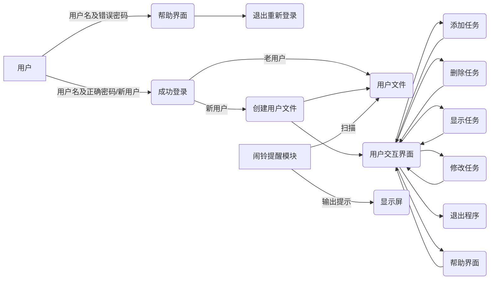

   

> Written with [StackEdit](https://stackedit.io/).

#  小组大作业——任务管理器

## 小组成员
- VioletEvar: 结构体与类的设计(account.h)，用户交互部分(userOperate函数，account.cpp)，多线程编写(main函数中线程创建等操作及各函数中互斥锁有关语句),跨平台实现
- Zachary: 结构体与类的设计(account.h)，闹钟提醒部分(userAlarm函数)；与时间有关的输入输出(addtask部分将命令行输入读入tm结构体，changetask修改任务，showtask部分将time_t类型变量转化为tm结构体变量输出)，跨平台实现
- peng-na: 所有GUI改编, 多线程编写（主线程和闹铃线程），文件互斥锁

## 流程图



## 模块与类的设计
### 任务结构体 Task
```c++
    struct Task {
    int id;         // 任务编号
    std::string name;       // 任务名字
    std::string startTime; // 任务开始时间
    std::string priority;   // 任务优先级，输入规定为 high medium low 三类
    std::string category;   // 任务类别，学习 娱乐 生活 其他等
    time_t reminderTime; // 任务提示时间
};
```

### 用户类 AccountManager
```c++
class AccountManager {
    friend void userOperate();//为用户操作界面函数提供接口
private:
    std::string username;//用户名
    std::string filename;//用户文件名
    std::string passwordHash;//密码哈希值
    std::vector<Task> tasks;//存储用户任务表的Task矢量tasks

    static bool sortTaskFunction(Task a, Task b);//用于比较两个任务开始时间顺序的函数
    bool taskExist(Task a);//判断同名同开始时间的任务是否已存在的函数
    void sortTasksByStartTime();//按开始时间对任务进行排序的函数

    std::string calculatePasswordHash(const std::string& password) const;//计算密码哈希值的函数

    void update();//更新本地文件的函数

public:
    AccountManager(const std::string& input_username, const std::string& input_password);//初始化函数，用于创建一个用户
    int max_id;//用户任务表中最大的任务序号，用于为新任务赋ID值
    std::string getFilename();//向外界提供文件名接口
    bool authenticate(const std::string& password) const;//验证输入密码是否正确
    void addTask(const Task& task);//添加任务
    void deleteTask(const int taskId);//删除任务
    void showTasks();//显示任务
};
```


## 具体函数代码

### 用户初始化函数
- 函数功能：初始化用户数据，创建用户名、密码哈希值和用户任务文件，并检测是否已创建账户。若已创建账户，则直接打开已经创建的账号文件；若未创建账户，则新建一个账号文件
- 函数输入：用户名，密码
- 函数输出：无
```c++
AccountManager::AccountManager(const std::string& input_username, const std::string& input_password) :username(input_username){
    std::string filename = input_username + "_task.txt";//为所有用户文件名添加固定后缀"_task.txt"
    max_id = 0;//初始化最大任务序号为0
    int filestate = createFile(filename);//创建整型变量接收createFile函数返回值
    std::string input_passwordHash = calculatePasswordHash(input_password);//计算输入密码的哈希值
//根据用户文件创建情况进行初始化处理
    switch(filestate){
case 0:{//已有用户文件
        std::ifstream is(filename);//打开用户文件
        std::string saved_passwordHash;
        std::getline(is, saved_passwordHash);//获取储存在用户文件第一行的密码哈希
        //判断输入密码是否正确
        if(input_passwordHash == saved_passwordHash){//输入密码正确
                passwordHash = saved_passwordHash;//初始化该账号密码哈希
                //将文件中数据录入账号的tasks任务表
                std::string line;
                std::getline(is,line);
                max_id = std::stoi(line);//读入文件中最大ID号
                while (std::getline(is, line)) {
                Task task;
                std::istringstream iss(line);//将每行文件加载到istringstream流iss上
                iss >> task.reminderTime >> task.name >> task.startTime >> task.category >> task.priority >> task.id ;//利用iss为任务各项数据成员赋值
                tasks.push_back(task);//添加任务到任务表中
                }
                is.close();//关闭文件
        }
        break;
}
case -1:{//用户文件创建失败
        std::cout << "调用文件创建函数失败!" << std::endl;
        break;
}
case 1:{//新用户，创建用户文件成功
        std::cout << "成功调用文件创建函数" << std::endl;
        passwordHash = input_passwordHash;//初始化密码哈希值
        max_id = 0;//初始化最大任务序号为0
        //将密码写入用户文件第一行
        std::ofstream os(filename);//以写入模式打开用户文件
        if(!os.is_open()){
                std::cout << "无法打开文件!" << std::endl;
        }
        os << passwordHash <<std::endl;
        //将最大任务id写入用户文件第二行
        os << max_id <<std::endl;
        os.close();//关闭用户文件

        break;
}
default:{//其他异常情况
        std::cout << "未知错误，账号创建不成功!"<< std::endl;
        break;
}

    }
        return;
}
```

### 创建用户任务文件的函数
- 函数功能：根据输入的文件名判断是否存在对应用户文件，若有，则返回0；若无，则创建新的用户文件。
- 函数输入：文件名
- 函数输出：整数(1, 0, -1)
```c++
int createFile(std::string filename){
        if(isCreated(filename)){
                return 0;//返回0代表已有用户文件
        }
        std::ofstream userfile(filename);//尝试创建新的用户
        if (!userfile.is_open()) {
            std::cout << "无法创建文件 " << filename << " 进行写入！" << std::endl;
            return -1;//返回-1代表创建失败
        }
        userfile.close();
        std::cout << "文件创建成功!" << std::endl;
        return 1;//返回1代表创建成功
}
```

### 检测用户文件是否已创建的函数
- 函数功能：根据输入文件名判断是否存在对应用户文件
- 函数输入：文件名
- 函数输出：True/False
```c++
bool isCreated(std::string filename){
        std::ifstream inputfile(filename);
        if (!inputfile) {
            return false;
        }
        return true;
}
```

### 密码加密函数
- 函数功能：根据输入的密码串输出对应的密码哈希值，改变字母大小写，数字保持不变
- 函数输入：密码字符串
- 函数输出：密码哈希值
```c++
std::string AccountManager::calculatePasswordHash(const std::string& password) const {
    std::string hashedPassword = "";//创建一个string变量储存密码哈希值
    int special_value = 0;//根据密码大写字母、小写字母及数字个数在哈希值结尾插入用户特殊值
	//遍历密码字符串，改变字母大小写，生成密码哈希
    for (char c : password) {
        if (std::isalpha(c)) {
            if (std::isupper(c)) {
                hashedPassword += std::tolower(c);
                special_value += 2;
            } 
            else {
                hashedPassword += std::toupper(c);
                special_value += 7;
            }
        } 
        else {//读到数字时跳过
            hashedPassword += c;
            special_value +=11;
        }
    }
	hashedPassword += std::to_string(special_value);//加入特殊后缀
    return hashedPassword;

}
```

### 密码校验函数
- 函数功能：判断用户输入密码是否正确
- 函数输入：用户密码
- 函数输出：True/False
```c++
bool AccountManager::authenticate(const std::string& password) const {
    // 将输入的密码进行哈希运算，并与保存的哈希值进行比较
    std::string inputHash = calculatePasswordHash(password);
    return inputHash == passwordHash;
}
```

### 用户文件更新函数
- 函数功能：更新用户文件内容
- 函数输入：无
- 函数输出：无
```c++
void AccountManager::update(){
        //清空用户文件
        //重新创建用户文件
        std::string newfilename = username + "_task.txt";//由用户名构造文件名确保后缀准确识别
        std::ofstream newfile(newfilename);
        //将密码写入第一行
        newfile << passwordHash << std::endl;
        //将最大ID号写入第二行
        newfile << max_id << std::endl;
        //将任务表写入新的用户文件
        //范围-based for 循环，它遍历 tasks 向量中的每个元素，并将当前元素赋值给变量 task。
        //const 修饰符表示 task 是一个常量引用，以确保不会对 data 中的元素进行修改。
        for(const Task& task : tasks){
                newfile << task.reminderTime << " " << task.name << " " << task.startTime << " " << task.category << " " << task.priority << " " << task.id << std::endl;
        }
        newfile.close();//关闭文件
        std::cout << "文件更新成功!" << std::endl;
}
```

### 检测任务是否重复的函数
- 函数功能：根据输入任务检测任务是否已存在
- 函数输入：一个任务结构体变量
- 函数输出：True/False
```c++
bool AccountManager::taskExist(Task a){
		//用for循环遍历任务表，检查是否有名字和开始时间相同的任务
        for (const Task& task : tasks){
                if(task.name == a.name && task.startTime == a.startTime){
                        return true;
                }
        }
        return false;
}
```

### 任务排序函数
- 函数功能：对任务表中任务按开始时间先后排序
- 函数输入：无
- 函数输出：无

```c++
//用于排序函数内部比较的函数
bool AccountManager::sortTaskFunction(Task a, Task b) {
    return a.startTime < b.startTime;//返回先开始的任务
}

//对用户任务按开始时间排序
void AccountManager::sortTasksByStartTime() {
    std::sort(tasks.begin(), tasks.end(), sortTaskFunction);//将任务表按任务开始时间先后排序
}
```

### 添加任务的函数
- 函数功能：将输入的任务添加至任务表，并更新用户文件
- 函数输入：一个任务结构体变量
- 函数输出：无

```c++
void AccountManager::addTask(const Task& task) {
	//检测任务是否已存在
    if(taskExist(task)){
            std::cout << "任务已存在!" << std::endl;
            max_id--;//防止max_id出现+2跳变
            return;
    }
    //若任务不存在，则添加至任务表
    else{
            tasks.push_back(task);
            update();//更新用户文件
    }
}
```

### 删除任务的函数
- 函数功能：将一个任务从任务表中删除，并更新用户文件
- 函数输入：整型变量taskID，即任务编号
- 函数输出：True/False
```c++
bool AccountManager::deleteTask(const int taskId) {
    //遍历任务表查找编号为taskId的任务，若找到则删除
    bool result = false;
    for (auto it = tasks.begin(); it != tasks.end(); ++it) {
        if (it->id == taskId) {
            tasks.erase(it);//调用vector类自带函数erase()从任务表中删除;为使用此函数，故for循环使用指针遍历tasks矢量
            result = true;
            break;
        }
    }
    update();//更新用户文件
}
```

### 显示任务的函数
- 函数功能：输出任务表中所有任务，按开始时间先后排序
- 函数输入：无
- 函数输出：无
```c++
void AccountManager::showTasks() {
// 将任务表中任务根据开始时间排序
    sortTasksByStartTime();
    std::cout <<"-----------------------------------------------------------------------" << std::endl;
    //遍历任务表，依次输出编号、任务名、开始时间、优先级、分类、提醒时间
    std::cout <<std::setw(3)<< "ID|" << std::setw(13) << "Name|" << std::setw(21)<< "Start Time|" << std::setw(17) << "Priority|" << std::setw(17)<< "Category|" << std::setw(22) <<"Reminder Time" << std::endl;
    for (const Task& task : tasks) {
        std::cout <<std::setw(2)<< task.id << "|" << std::setw(12) << task.name << "|" << std::setw(20) << task.startTime << "|" << std::setw(16) << task.priority << "|" << std::setw(16)<< task.category << "|" << std::setw(21) << ctime(&task.reminderTime)  <<std::endl;//利用ctime函数将time_t类型变量转化为tm结构体变量输出
    }
    std::cout <<"-----------------------------------------------------------------------" << std::endl;
}
```

### 提供文件名的接口函数
- 函数功能：为非AccountManager类的函数获取用户文件名提供接口
- 函数输入：无
- 函数输出：用户文件名
```c++
std::string AccountManager::getFilename(){
        return filename;
}
```

### 输出帮助界面的函数
- 函数功能：向用户显示帮助界面
- 函数输入：无
- 函数输出：无
```c++
void help(){
        std::cout << "这是帮助界面" << std::endl;
        std::cout << "输入h显示帮助界面" << std::endl;
        std::cout << "输入用户名和密码进入使用界面(如未创建账户会自动创建)" << std::endl;
        std::cout << "使用界面中，输入showtask显示任务表" << std::endl;
        std::cout << "使用界面中，输入addtask添加任务" <<std::endl;
        std::cout << "使用界面中，输入deltask删除任务" <<std::endl;
        std::cout << "使用界面中，输入quit退出程序" <<std::endl;
}
```

### 用户使用界面线程函数
- 函数功能：从命令行不断读入参数，执行添加任务、删除任务、显示任务、修改任务、显示帮助界面与退出程序的功能
- 函数输入：退出程序旗帜布尔变量quit
- 函数输出：无
```c++
void userOperate(AccountManager account, bool &quit){
		std::string command;// 创建接收命令行指令的字符串变量command
        // 循环检测用户指令
        while(true){
                std::cin>>command;// 从命令行读入指令
                std::transform(command.begin(), command.end(), command.begin(), ::tolower);//使用vector自带的transform函数将指令中所有字母转换为小写，实现大小写不敏感
                // 执行相应的命令
                if (command == "addtask") {//添加任务
                std::cout<<"请依次输入设置闹钟时间(年 月 日 时 分),任务名，任务开始时间(xxxx/xx/xx/xx:xx)"<<std::endl;
                // 解析其他命令行参数，并创建任务对象
                tm tm_tasktime = {0};//利用ctime库中tm结构体读取闹钟时间
        		Task task;

        		task.id = ++account.max_id;//利用account储存的最大ID号初始化新任务id
        		//由于tm结构体中年从1900年开始，月从0开始，故先利用int变量year、mon接收参数，实现用户按习惯输入时间的改善
        		int year = 0;
        		int mon = 0;
        		std::cin >> year >> mon >> tm_tasktime.tm_mday >> tm_tasktime.tm_hour >> tm_tasktime.tm_min >> task.name >> task.startTime;// >> task.category >> task.priority;
 				//任务类别含缺省值输入
 				std::cout << "请输入任务类别(默认为other类别)" << std::endl;
 				std::cin.get();//去除可能读取的换行符
 				std::string line;
 				std::getline(std::cin, line);//将一行输入读入字符串变量line储存
 				if(line == ""){
                                        task.category = "other";//默认任务类别为其他
 				}
 				else{
                                        task.category = line;
 				}
 				//任务优先级含缺省值输入并检测优先级合法性
                                std::cout << "请输入任务优先级(high | medium | low), 默认为low" << std::endl;
 				std::getline(std::cin, line);
 				if(line == "" || line == "low"){
                                        task.priority = "low";
 				}
 				else if(line == "medium"){
                                        task.priority = "medium";
 				}
 				else if(line == "high"){
                                        task.priority = "high";
 				}
 				else{
                                        std::cout << "输入优先级不符合格式，已设置为low" << std::endl;
                                        task.priority = "low";//输入不合法时设置为low
 				}

 				tm_tasktime.tm_year = year-1900; //tm_year表示从1900后经过的年份
 				tm_tasktime.tm_mon = mon - 1;//tm_mon中月份从0开始，故-1确保月份正确
 				task.reminderTime = mktime(&tm_tasktime);//利用mktime函数将tm结构体转化为time_t型变量储存
 				{
                                        std::lock_guard<std::mutex> lock(fileMutex);//在进行添加任务语句前锁住文件
                                        account.addTask(task);
 				}
                std::cout << "Task added successfully." << std::endl;

        }
         else if (command == "deltask") {
        // 解析其他命令行参数，获取要删除的任务的ID
                int taskId; //创建int变量taskId待删除任务ID
                std::cout << "请输入要删除的任务序号" << std::endl;
                std::cin >> taskId;
                {
                        std::lock_guard<std::mutex> lock(fileMutex);//在进行删除语句前锁住文件
                        account.deleteTask(taskId);
                }

                std::cout << "Task deleted successfully." << std::endl;

        }
        else if (command == "changetask") {//修改任务
         	std::string filename = account.getUsername() + "_task.txt";//获取文件名
         		std::ifstream inf(filename);
         		if(!inf){//检测是否成功打开用户文件
     				std::cout << "fail to open the file" << std::endl;
   				}
                //读取本地文件
                bool flag = false;
                Task task_c;
                std::cout << "请输入你想修改的任务ID:" ;
                int taskid,id;
		std::cin >> taskid;
                std::string line;
                std::string tasktime,taskname,startime,catagory,priority;
                while(getline(inf,line)){
                  std::istringstream is(line);//分割每一行字符，提取年月日时分进行写入
                  if(is >> tasktime >> taskname >> startime >> catagory >> priority >> id){ //将每一行写入变量
                	if(id == taskid){
                		//从文件中复制指定的task的内容到task_c中 方便后续修改后传入changeTask函数
                		task_c.category = catagory;
                		task_c.priority = priority;
                		task_c.id = id;
                		task_c.name = taskname;
                		task_c.startTime = startime;
                                task_c.reminderTime = stoi(tasktime);
                		int num;
                		flag = true;
                		std::cout << "请输入你想要修改的内容对应的序号（1.任务名称 2.任务开始时间 3.任务类别 4.任务优先级 5.任务提醒时间） : " ;
                		std::cin >> num;
                		switch(num){
                			case 1:{
                				std::cout << "请输入修改后的任务名称：" ;
                				std::cin >> task_c.name;
								break;
							}
                			case 2:{
                				std::cout << "请输入修改后的任务开始时间：" ;
                				std::cin >> task_c.startTime;
								break;
							}
                			case 3:{
                				std::cout << "请输入修改后的任务类别：" ;
                				std::cin >> task_c.category;
								break;
							}
                			case 4:{
                				std::cout << "请输入修改后的任务优先级：" ;
                				std::cin >> task_c.priority;
								break;
							}
                			case 5:{
                				tm t_tasktime = {0};
                				int year, mon;
                				std::cout <<"请依次输入新的提醒时间(年 月 日 时 分):" ;
                				std::cin >> year >> mon >> t_tasktime.tm_mday >> t_tasktime.tm_hour >> t_tasktime.tm_min;
                				t_tasktime.tm_year = year-1900;
 								t_tasktime.tm_mon = mon - 1;
 								task_c.reminderTime = mktime(&t_tasktime);
								break;
							}
                			default:{
                				std::cout << "非法输入！" << std::endl;
								break;
							}
						}
					}
				}
            }
            if(!flag) std::cout << "未找到该任务！" << std::endl; //遍历完文件根据flag判断是否查询到该任务
            std::lock_guard<std::mutex> lock(fileMutex);//锁住文件
            account.changeTask(task_c);
		}
        else if (command == "showtask") {//显示任务表中任务
		        account.showTasks();
        }
        else if(command == "h"){//显示帮助界面
                help();
        }
        else if(command == "quit"){//退出程序
                std::cout << "退出成功!" << std::endl;
                quit = true;//将quit变量改为true，作为flag让另一线程函数userAlarm结束
		        break;//结束while循环
        }
        else {
                // 用户输入未知命令
                std::cout << "命令未知" << std::endl;

                //输出帮助界面
                help();
        }
}

}
```
### 用户日程提醒函数
- 函数功能：从本地已有文件中读取用户相关日程信息，将提醒时间与当前系统时间进行比较（不断循环），到期则打印提醒
- 函数输入：用户名称（用以检索文件）
- 函数返回：无
```c++
//闹铃线程函数
void userAlarm(std::string filename){

        while(!quit_program){
              
                std::this_thread::sleep_for(2002ms);
                std::lock_guard<std::mutex> lock(fileMutex);//锁住文件
                time_t now; //读取当前时间
                time(&now);
    //std::string file = filename + "_task.txt";
    std::ifstream inf(filename);
    if(!inf){//检测是否成功打开

     std::cout << "fail to open the file" << std::endl;
    }
                //读取本地文件
                time_t tasktime;
                std::string line;
                std::string taskname,startime;
                //遍历匹配时间判断是否提醒
                while(getline(inf,line)){
                  std::istringstream is(line);//分割每一行字符，提取年月日时分进行写入
                  if(is >> tasktime >> taskname >> startime){
                                        time_t diff = now - tasktime;
                                        if(diff <= 1 && diff >= -1){
                                                //windows上响铃
                                                std::cout<<taskname<<"将于"<<startime<<"开始"<<std::endl;
                                                continue;
                                        }
                  } //写入格式为 time_t 任务名称 开始时间
                }
        }
}
```

### 主线程函数
- 函数功能：作为主线程，从命令行接收指令，创建用户、子线程并执行
- 函数输入：用户名字符串、输入密码字符串
- 函数输出：0
```c++
int main(int argc, char* argv[]) {
    // 解析命令行参数并执行相应操作
    if (argc < 3) {//检测命令行输入是否规范
        help();//输出帮助说明
        return 0;
    }

    std::string username = argv[1];//获取用户名
    std::string password = argv[2];//获取密码


    // 创建用户账号对象
    AccountManager account(username, password);

    // 密码验证，如果用户认证失败，则退出程序
    if (!account.authenticate(password)) {
        std::cout << "用户认证失败，请重新登录" << std::endl;
        return 0;
    }

        std::thread thread1(userOperate, std::ref(account), std::ref(quit_program));//用户操作模块
        std::string filename = username + "_task.txt";//创建文件名
        std::thread thread2(userAlarm, std::ref(filename));//任务提醒模块


    thread1.join();//等待线程1终止
    thread2.join();//等待线程2终止

    return 0;
}
```

## GUI改编

###  多线程实现
- 主线程：查看帮助、用户登录和日程管理功能
- 子线程：任务提醒功能

```c++
//AlarmThread.cpp
//闹铃线程函数
void AlarmThread::run(){

    QString qprintInf;

    while(!quit_program){

        Sleep(2*1001);  //检测周期,1001为了尽可能只提示一次
        lock_guard<mutex> lock(fileMutex); //锁住文件
        time_t now; //读取当前时间
        time(&now);
        ifstream inf(filename);
        if (!inf){
            //检测是否成功打开
            cout << "fail to open the file" << endl;
        }
        //读取本地文件
        time_t tasktime;
        string line;
        string taskname, startime;
        string printInf;
        //遍历匹配时间判断是否提醒
        while(getline(inf, line)){
            istringstream is(line); //分割每一行字符，提取年月日时分进行写入
            if (is >> tasktime >> taskname >> startime){
                time_t diff = now - tasktime;
                if (diff <= 1 && diff >= -1){
                    //响铃
                    cout << taskname << "will start at" << startime << endl;
                    printInf = taskname + " will start at " + startime;

                    qprintInf = QString::fromStdString(printInf);                   

                    qInfo() << qprintInf;

                    emit sendAlarm(qprintInf);

                    continue;
                }
            } //写入格式为time_t 任务名称 开始时间

        }
    }
}
```
### Widget类
```c++
class Widget : public QWidget
{
    Q_OBJECT
    friend class AccountManager;

public:
    Widget(QWidget *parent = nullptr);
    ~Widget();

signals:
    void starting(string filename);


private slots:
    void on_pushButton_4_released();

    void on_pushButton_released();

    void on_pushButton_3_released();

    void on_pushButton_2_released();

    void on_pushButton_6_released();

    void on_pushButton_5_released();

    void on_pushButton_8_released();

    void on_addTask_released();

    void on_pushButton_9_released();

    void on_pushButton_7_released();

    void on_pushButton_10_released();

    void on_pushButton_11_released();

private:
    Ui::Widget *ui;
    QSqlQuery *query; //!!!!

};
```
### 用户登录
```c++
void Widget::on_pushButton_5_released()
{
    //设置用户名和密码清除按钮
    ui->name->setClearButtonEnabled(true);
    ui->password->setClearButtonEnabled(true);

    //格式正确
    bool flag = true;

    //用户登录
    QString Qname = ui->name->text();
    string username = Qname.toStdString();  cout << username << endl;
    QString Qpassword = ui->password->text();
    string userpassword = Qpassword.toStdString();  cout << userpassword << endl;
    if (username == ""){
        cout << "name empty!" << endl;
        QMessageBox::warning(this, "提示", "用户名不能为空");
        //ui->name->setClearButtonEnabled(true);
        //ui->password->setClearButtonEnabled(true);
        flag = false;
    }
    if (userpassword == ""){
        cout << "password empty!" << endl;
        QMessageBox::warning(this, "提示", "密码不能为空");
        flag = false;
    }

    // 创建账户管理对象
    if (flag == true)
        AccountManager account(username, userpassword, ui);
    //检测是否已创建账户
    //若有，则直接打开已经创建的账号文件
    //若无，则新建一个账号文件


}
```
### 任务显示、添加、删除操作
- 在version_1.2的基础上，将原函数
``` void userOperate(AccountManager account, bool &quit)```
改为显示任务、添加任务、删除任务四个模块
- 各模块中运用互斥锁``` lock_guard<mutex> lock(fileMutex); ``` 锁住当前账户文件
- 利用槽函数实现Combo Box、Line Edit、Spin Box等控件信息录入，并通过List Widget控件展示信息


## 关键技术问题说明
### GUI主线程和闹铃线程的连接
- 子线程从主线程接收信号，开始运行；并将展示信息传回主线程，显示在屏幕上
```c++
// 子线程，控制闹铃
class AlarmThread : public QThread
{
    Q_OBJECT
public:
    explicit AlarmThread(QObject *parent = nullptr);
    void recvFilename(string fileName);

protected:
    void run() override;

signals:
    void sendAlarm(QString qprintInf);

private:
    string filename;

};
```


### 跨平台通用

- 使用c++各平台通用标准库，如chrono库实现线程休眠，thread库构建线程

###  用户文件创建、读取、写入

- 使用fstream库创建istream与ostream

###  多线程构建
- 使用thread库中线程初始化函数创建线程
- 使用thread库中thread.join()函数等待子线程终止
- 使用mutex库为线程添加锁

### 时间输入、读取、输出
- 使用ctime库里的tm和time_t类型进行时间类的转化与比较
- tm为struct类型，可对tm的成员直接进行读入，再对tm到time_t类型进行转化
- tm的输出被重载，可以直接进行格式化输出（或利用ctime库函数进行string的转化）
- 对系统时间进行有一定间隔的轮询，并与提醒时间进行差值比较，在范围内则可进行输出
- 轮询间隔较短，保证了锁的正常功能


